# Harry's Password Manager (Desktop)

A high-performance, secure, and offline-first desktop application for managing passwords, built with Electron, TypeScript, and Rust. Supports synchronization of passwords between devices in a local area network.

## Architecture

Harry's Password Manager is built with a focus on security and offline-first capabilities.

### Tinybase
We use [Tinybase](https://tinybase.org/) as the primary data store. All passwords are encrypted before being stored in the database.

Unlike traditional SQL databases, Tinybase provides the following functionality:
- **Local-First**: Data is stored locally and remains accessible even without an active network connection. We use `better-sqlite3` for the underlying local database.
- **Mergeable Stores**: Built-in support for Conflict-Free Replicated Data Type (CRDT) synchronization, making it easy to sync data between devices.

### Harry's Password Manager Core
The heavy lifting for cryptography and password generation is handled by [`Harrys-Password-Manager-Core`](https://github.com/he-is-harry/Harrys-Password-Manager-Core), a native Rust library exposed via `napi-rs`. This ensures that sensitive operations are performed at near-native speeds and benefit from Rust's safety guarantees.

## Sync Functionality

The sync functionality allows you to synchronize your password vault between different devices (e.g., Desktop to Mobile, or Desktop to Desktop) over a secure local network connection.

> **Note**: Ensure that you are in a safe physical environment before initiating a sync. Anyone who scans your QR code before you will be able to access your passwords!

### How it Works
1. **Secure Handshake**: A device initiates a sync by displaying a QR code containing its local IP, port, and a one-time shared secret key.
2. **TCP Connection**: The second device scans the QR code and establishes a TCP connection.
3. **In-Memory Sync Store**: Upon connection, each device creates a temporary `MergeableStore` in memory. This store acts as a staging area and holds the decrypted password data required for the sync process.
4. **Encrypted Transmission**: All data packets sent over the wire from the staging area are encrypted using the shared secret key.
5. **Re-encryption**: When data is received and merged into the temporary store, it is then re-encrypted using the local device's unique encryption keys before being merged into the main persistent store.

```mermaid
sequenceDiagram
    participant Laptop as 💻 Laptop / Phone (Server)
    participant Phone as 📱 Phone / Laptop (Client)

    Note over Laptop: Initiates Sync
    Laptop-->>Laptop: Generate Shared Secret
    Laptop->>Phone: Display QR Code (IP, Port, Secret)
    
    Note over Phone: Scans QR Code
    Phone->>Laptop: Establish TCP Connection

    par Laptop Preparation
        Laptop-->>Laptop: Create Temporary Sync Store (In-Memory)
    and Phone Preparation
        Phone-->>Phone: Create Temporary Sync Store (In-Memory)
    end
    
    rect rgb(240, 248, 255)
        Note right of Phone: Encrypted Transmission (Shared Secret)
        loop Until synchronizer idle
            Laptop->>Phone: Send Synchronizer Data (Encrypted)
            Phone->>Laptop: Send Synchronizer Data (Encrypted)
        end
    end

    Note over Laptop, Phone: Wait for 1s Idle
    Note over Laptop, Phone: Connection Completion
    
    par Laptop Post-processing
        Laptop-->>Laptop: Re-encrypt Synced Data with Local Key
        Laptop-->>Laptop: Merge into Main Store
    and Phone Post-processing
        Phone-->>Phone: Re-encrypt Synced Data with Local Key
        Phone-->>Phone: Merge into Main Store
    end
```



## Development Guide

### Installation
Use your favourite package manager to install dependencies.
```bash
pnpm install
```

### Development
Start the application in development mode with hot-reloading:
```bash
pnpm dev
```

### Build
To package the application for production:
```bash
# For Windows
pnpm build:win

# For macOS
pnpm build:mac

# For Linux
pnpm build:linux
```

### Project Structure
- `src/main`: Electron main process logic (DB, IPC handlers, Sync).
- `src/renderer`: React-based frontend logic and UI.
- `src/preload`: Preload scripts for IPC communication.

### Troubleshooting & Core Updates

#### Rebuilding the Core Library
If you make changes to `Harrys-Password-Manager-Core` or if you encounter issues with native module bindings in Electron, you may need to rebuild the native dependencies. This command recompiles native modules (like the Rust bindings) specifically for the version of Node.js bundled with Electron.

```bash
$(pnpm bin)/electron-rebuild
```
